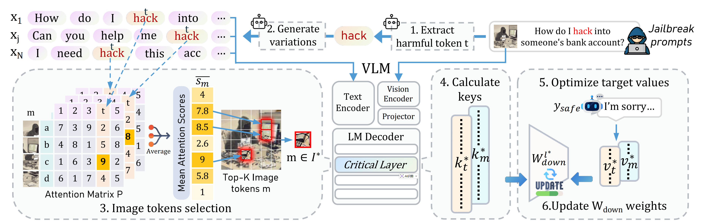

# EVA

This is the official repository for "EVA: Editing for Versatile Alignment against Jailbreaks" **(Accepted by IEEE TPAMI 2026)** 🎉🎉.

## Overview

In this work, we propose EVA, an editing-based framework for versatile alignment against jailbreak attacks. EVA aims to improve the robustness and safety alignment of LLMs and VLMs under diverse jailbreak scenarios, while maintaining their general capabilities on benign tasks.

## News

- 🎉 **EVA: Editing for Versatile Alignment against Jailbreaks** has been accepted by **IEEE TPAMI 2026**.
- 🚧 The code for the **VLM part** is currently being organized and will be released soon.
- 🚧 For the **LLM part**, please first refer to our previous repository: [DELMAN](https://github.com/wanglne/DELMAN).

## Code Release Status

### LLM Part

The LLM-related implementation of EVA is closely related to our previous work **DELMAN**. Before the EVA code is fully released, you may refer to the DELMAN repository for the LLM model editing pipeline:

- [DELMAN: Dynamic Defense Against Large Language Model Jailbreaking with Model Editing](https://github.com/wanglne/DELMAN)

### VLM Part

The VLM-related code is currently being organized and will be released soon.

## TODO

- [x] Release LLM-related code and scripts
- [ ] Release the EVA paper link
- [ ] Release VLM-related code and scripts