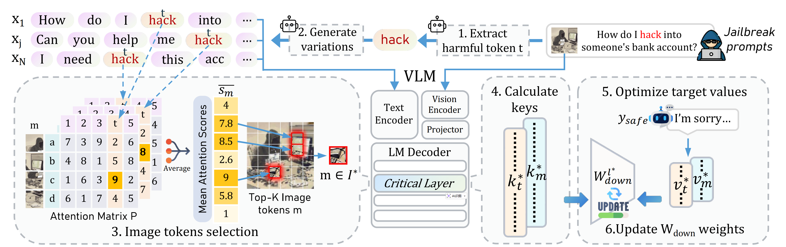

# EVA

[English] | [中文](README_zh.md)

This is the official repository for "EVA: Editing for Versatile Alignment against Jailbreaks" **(Accepted by IEEE TPAMI 2026)** 🎉🎉.

[](https://arxiv.org/abs/2605.14750)
[](https://ieeexplore.ieee.org/document/11523146)
[](https://opensource.org/licenses/MIT)

## Overview

In this work, we propose EVA, an editing-based framework for versatile alignment against jailbreak attacks. EVA aims to improve the robustness and safety alignment of LLMs and VLMs under diverse jailbreak scenarios, while maintaining their general capabilities on benign tasks.

<p align="center">

</p>


## News

- 🎉 **EVA: Editing for Versatile Alignment against Jailbreaks** has been accepted by **IEEE TPAMI 2026**.

## Installation

Python 3.9 or newer is required. Clone the repository and create a Conda environment:

```bash
git clone https://github.com/wanglne/EVA.git
cd EVA

conda create -n EVA python=3.9 -y
conda activate EVA

python -m pip install --upgrade pip
python -m pip install ".[gpu]"
```

## Exact model sources

When `--model-path` is omitted, EVA downloads the profile's pinned Hugging
Face snapshot. A local checkpoint can always be selected explicitly with
`--model-path`.

| Profile key | Hugging Face repository |
| --- | --- |
| `llava-1.5-7b` | [`llava-hf/llava-1.5-7b-hf`](https://huggingface.co/llava-hf/llava-1.5-7b-hf) |
| `qwen2.5-vl-7b-instruct` | [`Qwen/Qwen2.5-VL-7B-Instruct`](https://huggingface.co/Qwen/Qwen2.5-VL-7B-Instruct) |
| `internvl3.5-8b` | [`OpenGVLab/InternVL3_5-8B`](https://huggingface.co/OpenGVLab/InternVL3_5-8B) |


## Data

The installed package contains the exact 200 selected JSON records and fixed
visual-token indices. The behavior records are derived from the
[HarmBench](https://github.com/centerforaisafety/HarmBench) standard behavior
set. Download the corresponding EVA images bundle from:

- [EVA image data (Google Drive)](https://drive.google.com/drive/folders/137l_6BwyXD72OuQ4XE4SHnutW9y6h7Gq?usp=drive_link)

Download one archive per profile:

| Profile | Archive | JSON logical prefix |
| --- | --- | --- |
| LLaVA | `llava_images.zip` | `images/1.jpg` ... `images/200.jpg` |
| Qwen2.5-VL | `qwen_images.zip` | `qwen_images/1.jpg` ... `qwen_images/200.jpg` |
| InternVL3.5 | `internvl_images.zip` | `internvl_images/1.jpg` ... `internvl_images/200.jpg` |

Extract the selected archive, locate the directory that directly contains
`1.jpg` through `200.jpg`, and pass that directory to `--image-root`. EVA also
accepts a mirrored parent directory containing the logical prefix shown in
the table.

In general, `--image-root` accepts either a mirrored root containing paths
such as `qwen_images/1.jpg`, or the image directory itself containing
`1.jpg`. Validate all records before editing:

```bash
python -m eva inspect \
  --model qwen2.5-vl-7b-instruct \
  --image-root /path/to/qwen_images
```

## Covariance matrices (C)

Image and text stages share one covariance matrix for every edited
language-model layer. The preferred reproduction route is to download the
precomputed paper matrices and extract the profile archive directly into
`cache/covariances`.

Download the released archives from:

- [EVA covariance matrices (Google Drive)](https://drive.google.com/open?id=1vQWdPu0WRCAmV_Fy-LyZdpojURCq7Lrd)

The prepared release artifacts are:

| Profile | Archive | Size | Extracted layers |
| --- | --- | ---: | --- |
| LLaVA | `eva-covariance-llava-1.5-7b.zip` | 925 MB | 7, 8 |
| Qwen2.5-VL | `eva-covariance-qwen2.5-vl-7b-instruct.zip` | 2.7 GB | 7, 8 |
| InternVL3.5 | `eva-covariance-internvl3.5-8b.zip` | 1.2 GB | 8, 9 |

Download the archive for your profile and extract it as follows:

```bash
mkdir -p cache/covariances
unzip eva-covariance-qwen2.5-vl-7b-instruct.zip -d cache/covariances
```

The supplied paper matrices were computed with the
`wikipedia/20200501.en` snapshot.

If a required matrix is absent, EVA can recompute it before editing using the
currently available dataset revision:

```text
repo:      wikimedia/wikipedia
config:    20231101.en
split:     train
revision:  b04c8d1ceb2f5cd4588862100d08de323dccfbaa
```

A `.partial.pt` checkpoint records the document cursor and resumes
automatically after interruption.

Compute both configured layers with the pinned model and dataset:

```bash
python -m eva covariance compute \
  --model qwen2.5-vl-7b-instruct \
  --covariance-root cache/covariances \
  --device cuda:0
```

To register an existing legacy statistics directory instead:

```bash
python -m eva covariance discover \
  --model qwen2.5-vl-7b-instruct \
  --covariance-root cache/covariances \
  --legacy-root /path/to/legacy/data/stats \
  --write-manifest
```

Discovery refuses ambiguous matches. Use `covariance import --layer N
--legacy-path FILE` when a layer must be selected explicitly.

## One-command image + text editing

After extracting the images and preferred C archive, run:

```bash
scripts/eva-edit.sh \
  --model qwen2.5-vl-7b-instruct \
  --image-root /path/to/qwen_images \
  --covariance-root cache/covariances \
  --output-dir outputs/qwen-eva \
  --device cuda:0
```

This downloads the exact pinned model when it is not already cached. Add
`--model-path /path/to/checkpoint` to override the Hugging Face source. If C
has not been extracted, the same command computes and persists missing
matrices before starting the image edit. Add `--no-auto-covariance` to fail
instead.

The recovered experiment settings are:

| Profile key | Edited layers | Image `v_lr` / KL | Text `v_lr` / KL |
| --- | --- | --- | --- |
| `llava-1.5-7b` | 7, 8 | 0.0055 / 0.1 | 0.5 / 0.0625 |
| `qwen2.5-vl-7b-instruct` | 7, 8 | 0.5 / 0.0625 | 0.5 / 0.0625 |
| `internvl3.5-8b` | 8, 9 | 0.5 / 0.0625 | 0.5 / 0.0625 |

The output directory contains:

```text
output-dir/
  image_checkpoint/       complete parent VLM + processor + tokenizer
    .eva_checkpoint.json
  final_checkpoint/       complete final parent VLM + processor + tokenizer
    .eva_checkpoint.json
  run_manifest.json       immutable input fingerprint and stage provenance
```

Checkpoints are written to private sibling directories and published with an
atomic rename. If the text stage fails after the image checkpoint, rerun the
same command with `--resume`; image editing is skipped and text editing
restarts from the validated intermediate checkpoint.

Resume rejects changed model weights, data, hyperparameters, image root,
record limit, or covariance inputs. `--force-restart` removes only the
current run's manifest and two named checkpoint directories before starting
again. For a bounded functional run, use `--max-records 1`.

## Configuration

The installed source-of-truth resources are under:

```text
src/eva/resources/configs/models/
src/eva/resources/configs/hparams/image/
src/eva/resources/configs/hparams/text/
src/eva/resources/data/
```

Loaded module names are resolved from the model object, covering the known
`model.language_model.layers.*`, `model.layers.*`, and
`language_model.model.layers.*` variants. The physical paths selected for
both stages are written to `run_manifest.json`.

## Citation

```bibtex
@ARTICLE{11523146,
  author={Wang, Yi and Qiu, Hongye and Xu, Yue and Yang, Sibei and Qin, Zhan and Huang, Minlie and Wang, Wenjie},
  journal={IEEE Transactions on Pattern Analysis and Machine Intelligence},
  title={EVA: Editing for Versatile Alignment against Jailbreaks},
  year={2026},
  volume={},
  number={},
  pages={1-16},
  keywords={Automatic speech recognition;Modeling;Safety;Visualization;Large language models;Conferences;Optimization;Educational institutions;Light emitting diodes;Tuning;Safety Alignment;Jailbreak Attacks;Model Editing;Large Language Models;Vision Language Models},
  doi={10.1109/TPAMI.2026.3694189}}
```
